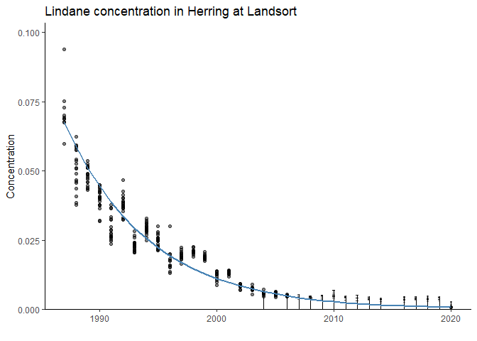

mixcens package
================
Martin Sköld
2022-12-19

## 

This R package was constructed as a faster alternative to (now retired)
[`lmec`](https://github.com/cran/lmec) for fitting linear mixed models
for left-censored data, to be used for trend detection within the
Swedish national monitoring programme for contaminants in biota. It fits
a left-censored version of the linear mixed model
$y_{ij} = \alpha + \beta t_j+ b_j + \epsilon_{ij}$ for replicate
measurements $y_{1j}, \ldots, y_{n_jj}$ within a “monitoring year” $t_j$
sharing a common random effect $b_j\sim N(0, s^2)$ and individual
effects $\epsilon_{ij} \sim N(0, \sigma^2)$. The fit is based on
numerical maximization of the corresponding likelihood approximated by
Gauss-Hermite quadrature.

# Sample usage

Install package by

``` r
devtools::install_github("https://github.com/mskoldSU/mixcens")
```

The package comes with a sample data-set, `lindane_landsort`, containing
concentrations of Lindane measured in Herring muscle caught near
[Landsort](https://en.wikipedia.org/wiki/Landsort) in the Baltic Sea
1987-2020.

``` r
library(mixcens)
lindane_landsort
```

    ## # A tibble: 455 × 3
    ##     year  value cens 
    ##    <dbl>  <dbl> <lgl>
    ##  1  1987 0.0597 FALSE
    ##  2  1987 0.0751 FALSE
    ##  3  1987 0.0677 FALSE
    ##  4  1987 0.094  FALSE
    ##  5  1987 0.0701 FALSE
    ##  6  1987 0.0689 FALSE
    ##  7  1987 0.0689 FALSE
    ##  8  1987 0.0728 FALSE
    ##  9  1987 0.0693 FALSE
    ## 10  1987 0.0674 FALSE
    ## # … with 445 more rows

Here, `value` denotes a measured concentration if `cens == FALSE` and an
upper limit (LOD) if `cens == TRUE`. A censored log-linear mixed model
is fit using function `mixcens`

``` r
fit <- with(lindane_landsort, mixcens(x = year, y = value, cens = cens, family = "lognormal"))
```

Results (on the linear scale) are given by

``` r
summary(fit)
```

    ## Censored linear mixed model fit by 'mixcens'
    ## 
    ## Total 159 out of 455 observations censored.
    ## 
    ##                Estimate  Std. Error z value  Pr(>|z|)    
    ## (Intercept) 273.2421986   9.2907942  29.410 < 2.2e-16 ***
    ## (Slope)      -0.1388711   0.0046479 -29.878 < 2.2e-16 ***
    ## ---
    ## Signif. codes:  0 '***' 0.001 '**' 0.01 '*' 0.05 '.' 0.1 ' ' 1
    ## 
    ## 
    ## Random effect standard deviation:  0.176 
    ## Residual standard deviation:  0.108

This corresponds to an annual decrease of

``` r
100 * (exp(fit$beta[2]) - 1)
```

    ## [1] -12.96598

percent in concentration. The fitted line can be plotted using

``` r
plot(fit) + ggplot2::labs(y = "Concentration", title = "Lindane concentration in Herring at Landsort")
```

<!-- -->

where censored observations are represented by vertical bars.
